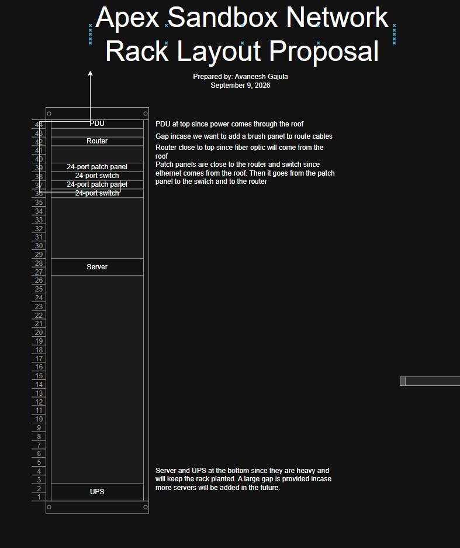

# Network Rack Diagram

Image | 09 2026

## Summary

This project required to design a layout proposal for our class's network rack. Attached is the diagram illustrating what I believe to be the optimal layout for our network rack.

Changes after review by network engineer:
    - Move server to eye level(29U) for easier access for maintenance and protection from flooding.
    - Move Router up for visual hardware separation

**Project:** Network Rack Diagram

**My role:** Developed a network rack diagram

## The Artifact

## Skills Demonstrated

collaboration
Responsibility & Reliability

## What I Learned

I learned about the components that go into a network rack and why their positioning on the rack is important into creating the most functional and efficient network rack possible.
---

[Return to All Artifacts]({{ '/artifacts.html' | relative_url }})