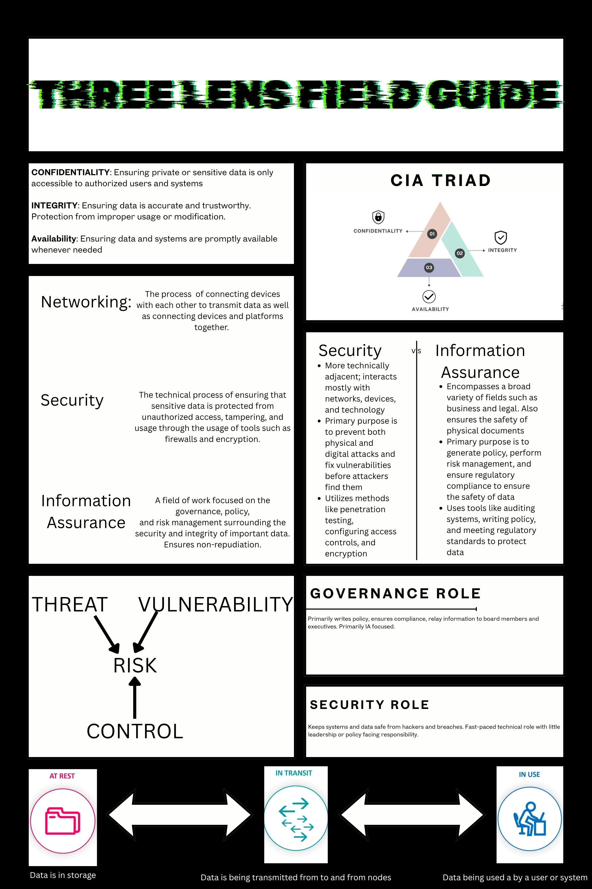

# Three Lens Field Guide

Image | [Month Year]

## Summary

**Project:** CS Lab and Rack Setup

**My role:** Made a Three-Lense Field Guide flyer

## The Artifact

## Skills Demonstrated

collaboration
Responsibility & Reliability

## What I Learned

I learned the elements of the CIA triad, the three components of cybersecurity(IA, security, networking) and their respective definitions.
---

[Return to All Artifacts]({{ '/artifacts.html' | relative_url }})