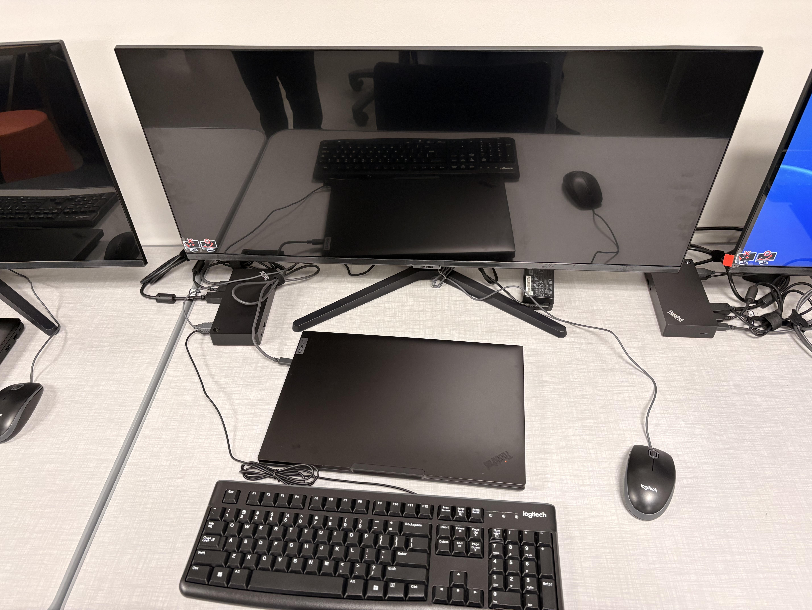
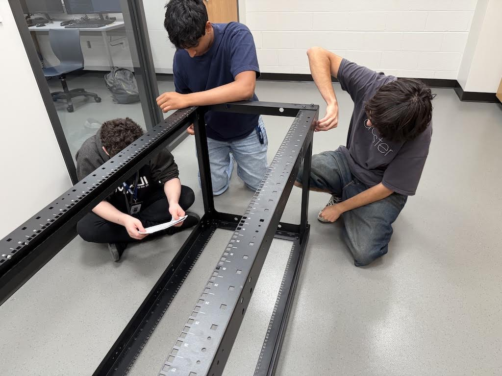
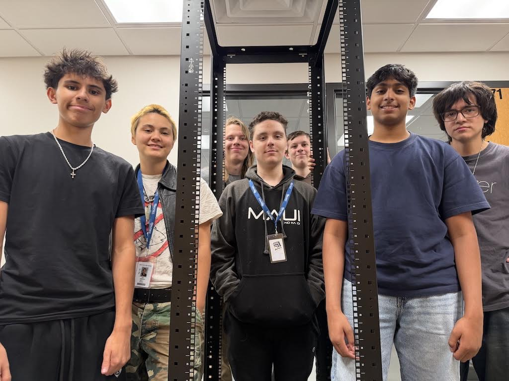

# CS Lab and Rack

Image | 08 2026

## Summary

A workstation with a laptop, monitor, docking port, keyboard, and mouse. A network rack for our LAN. 

**Project:** CS Lab and Rack Setup

**My role:** I setup workstation 8. I worked on doing cable management for workstations 11-13. CJ, Yanitxan, and I verified the integrity of the assembly of the rack.

## The Artifact

[View the full artifact](LINK-TO-ARTIFACT)

## Skills Demonstrated

collaboration
Responsibility & Reliability

## What I Learned

I learned how to properly manage cables to ensure you have a neat and efficient workstation. I also learned how to assemble a server rack correctly.
---

[Return to All Artifacts]({{ '/artifacts.html' | relative_url }})